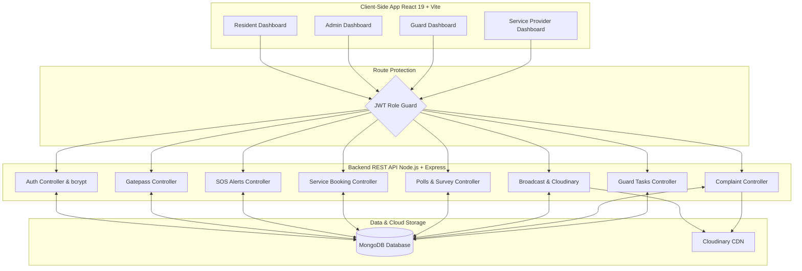

# 🏢 Averra: Smart Residential & Community Management System

[](https://nodejs.org/)
[](https://react.dev/)
[](https://tailwindcss.com/)
[](https://mui.com/)
[](https://www.mongodb.com/)
[](#-copyright-registration)

**Averra** is a state-of-the-art, role-based residential society and community management ecosystem designed to streamline security operations, facility bookings, administrative oversight, emergency alerting, and vendor-resident collaborations. It features a responsive React dashboard, an Express.js REST API backend, and secure MongoDB data storage.

---

## 🗺️ System Architecture



---

## 👥 Role-Based Access Matrix

Averra relies on rigid Role-Based Access Control (RBAC) to present customized views and features to four distinct types of users:

| Feature / Permission | 👤 Resident | 👮 Guard | 🛠️ Service Provider | 🔑 Admin |
| :--- | :---: | :---: | :---: | :---: |
| **Request Visitor Gatepass** | ✔️ | ❌ | ❌ | ❌ |
| **Approve / Reject Gatepass** | ❌ | ✔️ | ❌ | ❌ |
| **Trigger Emergency SOS Alerts** | ✔️ | ❌ | ❌ | ❌ |
| **Respond to SOS / Resolve Alerts** | ❌ | ✔️ | ❌ | ✔️ |
| **Book Service Providers** | ✔️ | ❌ | ❌ | ❌ |
| **Manage Bookings (Accept/Reject)** | ❌ | ❌ | ✔️ | ❌ |
| **Vote in Community Polls** | ✔️ | ✔️ | ❌ | ❌ |
| **Create Polls & Surveys** | ❌ | ❌ | ❌ | ✔️ |
| **Submit / Cancel Complaints** | ✔️ | ❌ | ❌ | ❌ |
| **Review & Update Complaints Status**| ❌ | ❌ | ❌ | ✔️ |
| **Publish Announcements / Broadcasts**| ❌ | ❌ | ❌ | ✔️ |
| **Manage Guard Tasks** | ❌ | ❌ | ❌ | ✔️ |
| **Perform Guard Task Checklists** | ❌ | ✔️ | ❌ | ❌ |

---

## 🔥 Key Features

### 1. 👮 Visitor Gatepass System
* **Pre-Approval Invites**: Residents create visitor requests specifying the guest's name, purpose of visit, and expected time of entry.
* **Instant Gate Verification**: Guards view pending requests on their dashboard and can instantly approve or reject entry upon the guest's arrival, logging custom comments.

### 2. 🚨 Emergency SOS Alerting System
* **Instant Alarm Triggers**: Residents in distress can click a single-button emergency SOS categorizing it into **Medical**, **Fire**, or **Security** threats.
* **Real-time Guard & Admin Desks**: Guards and administrators receive immediate system-wide alerts, allowing them to mark emergencies as "Assigned" or "Resolved" with tracking logs.

### 3. 🛠️ Service Booking Platform
* **Local Provider Directory**: Services offered include **Plumbers**, **Electricians**, **Housekeeping**, **Cooks**, and **Tutors**.
* **Availability Matching**: Residents view active local providers, schedule appointments, and trace progress.
* **Provider Dashboard**: Local workers can toggle their availability status and accept/reject service requests.

### 4. 📊 Public Polls & Community Voting
* **Democratic Feedback**: Admins create community-wide polls with specific titles, options, and expiration dates.
* **Anti-Cheat Restrictions**: The database maps users to vote structures ensuring one-vote-per-person limits.

### 5. 📢 High-Priority Broadcasting
* **Rich Notices**: Admins release society-wide messages with optional header image uploads (handled via Cloudinary).
* **Alert Categories**: Broadcasts are categorized as informational posts or events, flagged with styling cues (**Info**, **Warning**, **Danger**).

### 6. 📝 Society Complaint Desk
* **Upload Evidentiary Images**: Residents raise tickets containing detailed issues, urgency states (Low, Medium, High), and upload image proofs.
* **Traceable Lifecycles**: Admins track complaints through their lifecycle (Open -> In Progress -> Resolved).

---

## 🛠️ Tech Stack & Dependencies

### Frontend (`/Frontend`)
* **Libraries & Framework**: React 19, Vite 6, React Router DOM v7
* **Styling**: Tailwind CSS v4, Material-UI (MUI v7), React Bootstrap (v2.10)
* **Animations**: Framer Motion, AOS (Animate on Scroll)
* **State & Networking**: Axios (REST Client), Recharts (Analytics and Data Visualization)
* **Notifications**: Sonner, React-Toastify, SweetAlert2

### Backend & Server (`/Server`)
* **Runtime**: Node.js & Express.js (v5.1.0)
* **Database**: MongoDB & Mongoose ORM
* **Authentication**: JSON Web Tokens (JWT) & bcrypt hashing
* **File Upload Pipeline**: Multer & Multer-Storage-Cloudinary

---

## 📂 Repository Structure

```bash
├── Files/                     # Copyright certificates & intellectual property forms
├── Frontend/                  # React Single Page Application (SPA)
│   ├── src/
│   │   ├── Components/
│   │   │   ├── Admin/         # Admin dashboards, broadcast, polls, complaints portals
│   │   │   ├── Guard/         # Gatepass approvals & emergency responder dashboards
│   │   │   ├── Resident/      # Service directory, booking, SOS triggers, gatepass requests
│   │   │   ├── SP/            # Service provider schedule & availability dashboards
│   │   │   └── LandingPage.jsx# Interactive landing portal
│   │   ├── Forms/             # Standard Login/Registration handlers
│   │   └── main.jsx
│   ├── package.json
│   └── vite.config.js
└── Server/                    # RESTful Backend API
    ├── controllers/           # Auth, Booking, Gatepass, SOS, and Broadcast controllers
    ├── db/                    # MongoDB connection settings
    ├── middlewares/           # JWT and route guards
    ├── models/                # MongoDB Schema declarations
    ├── routes/                # Express Route declarations
    ├── server.js              # Node.js entry script
    └── package.json
```

---

## 🚀 Setup & Execution Instructions

### Prerequisites
* [Node.js](https://nodejs.org/) (v18 or higher recommended)
* MongoDB connection URI
* Cloudinary API Credentials (for broadcast and complaint image uploads)

---

### Step 1: Server Configuration & Initialization

1. Navigate to the server folder:
   ```bash
   cd Server
   ```

2. Install backend dependencies:
   ```bash
   npm install
   ```

3. Create a `.env` file in the `Server/` directory and complete the required variables:
   ```env
   PORT=5000
   MONGO_URI=mongodb+srv://<username>:<password>@cluster0.mongodb.net/averra
   JWT_SECRET=your_jwt_strong_secret_key
   CLOUDINARY_CLOUD_NAME=your_cloudinary_cloud_name
   CLOUDINARY_API_KEY=your_cloudinary_api_key
   CLOUDINARY_API_SECRET=your_cloudinary_api_secret
   ```

4. Launch the developer server (supports hot reloading via nodemon):
   ```bash
   npm run dev
   ```
   *The server will run on the port specified in your `.env` (default is `5000`).*

---

### Step 2: Frontend Configuration & Initialization

1. Open a new terminal session and navigate to the frontend folder:
   ```bash
   cd Frontend
   ```

2. Install frontend dependencies:
   ```bash
   npm install
   ```

3. Configure your API base URL in `config.js`:
   ```javascript
   // Ensure it points to your server port
   export const API_BASE_URL = "http://localhost:5000/api/v1";
   ```

4. Boot the Vite development environment:
   ```bash
   npm run dev
   ```
   *The application will boot, usually accessible on `http://localhost:5173`.*

---

## 📜 Copyright Registration

Averra is an officially registered computer program under copyright guidelines. Full filing documentations, NOC authorizations, and source declarations are stored inside the [/Files](./Files) directory for reference:

* **Title of Work:** Averra (Computer Program)
* **Author & Registrar:** Abhishek Duggal
* **Year of Registration:** 2026
* **Protected Components:** Server schemas & routers, client routes & role gates, and full business logic engines.
* **Filing Artifacts:**
  * [Registration Form XIV](./Files/Form-XIV-Registration%20of%20Copyright.pdf)
  * [NOC & Author Declaration](./Files/NO%20OBJECTION%20CERTIFICATE%20AUTHOR%20DECLARATION.pdf)
  * [Official Copyright Certificate](./Files/Copyright%20Office.pdf)
